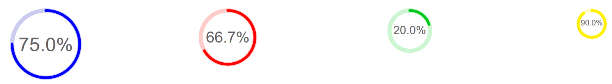

# vue2-circle-percent
vue2-circle-percent is a vue2 component useful to display percentage values with an animated circle.



## Usage
Just download CircularPercentage.vue component and import in your project.
If you need more examples, simply take a look at App.vue or clone the repository, install it with npm or yarn and run it.  

```
yarn install
yarn serve
```

## Params
vue2-circle-percent exposes following params:
* done: **Required** Number type, it represents the completed part of the circle
* missing: **Required** Number type, it represents the uncompleted part of the circle
* size: **Default 100** Number type, you should use an Integer ideally between 25 and 100
* arcColor: **Default #00c71b** String type, color associated to _done_ param 
* bgCircleColor: **Default #00cc1b33** String type, color associated to _missing_ param

## Example
```
<template>
    <div>
        <circular-percentage size="80" :done="60" :undone="30" arcColor="#ff0000" bgCircleColor="#ff000033" />
    </div>
</template>
  
<script>
  import CircularPercentage from './components/CircularPercentage.vue'
  
  export default {
    name: 'example',
    components: {
        CircularPercentage
    }
  }
</script>
  ```

## License

This project is licensed under MIT License.